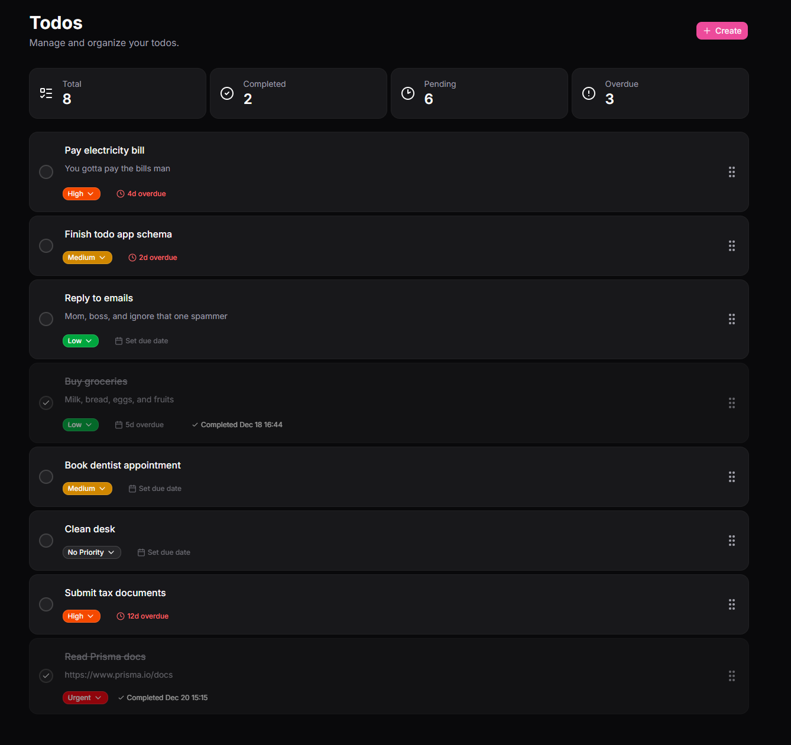

# Axov

**Axov** is an open-source, next-generation productivity suite designed to help you manage your tasks, projects, and schedule—all in one place.

## ✨ Key Features

- **To-do Management:** Create, organize, and prioritize your tasks efficiently.
- **Kanban Boards:** Visualize your workflow and track progress with drag-and-drop boards.
- **Calendar Scheduling:** Plan your days and never miss a deadline with an integrated calendar.
- **Modern UI:** Built with [shadcn/ui](https://ui.shadcn.com/) for a sleek, responsive experience.
- **Database-Backed:** Powered by [Prisma](https://www.prisma.io/) and PostgreSQL for robust data management.

---

## 🚀 Tech Stack

- [Next.js 16](https://nextjs.org/)
- [shadcn/ui](https://ui.shadcn.com/)
- [Prisma](https://www.prisma.io/)

---

## 📸 Preview

Random Progress Screenshot for Todos:



---

## 🛠️ Getting Started

Follow these steps to set up Axov locally:

1. **Clone the repository:**

```bash
git clone https://github.com/CuteNikki/axov.git

cd axov
```

2. **Install dependencies:**

```bash
bun install
```

3. **Configure your environment:**

- Copy `.env.example` to `.env` and update your database credentials.

4. **Run database migrations:**

```bash
bun prisma:migrate
```

5. **Start the development server:**

```bash
bun run dev
```

6. **Open [http://localhost:3000](http://localhost:3000) in your browser.**

---

## 🤝 Contributing

Contributions, issues, and feature requests are welcome!  
Feel free to check the [issues page](https://github.com/yourusername/axov/issues) or submit a pull request.

---

## 📄 License

This project is licensed under the MIT License.

---

_This project is under active development. Star the repo to stay updated!_
